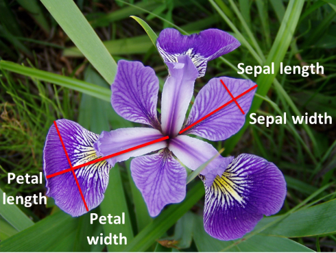
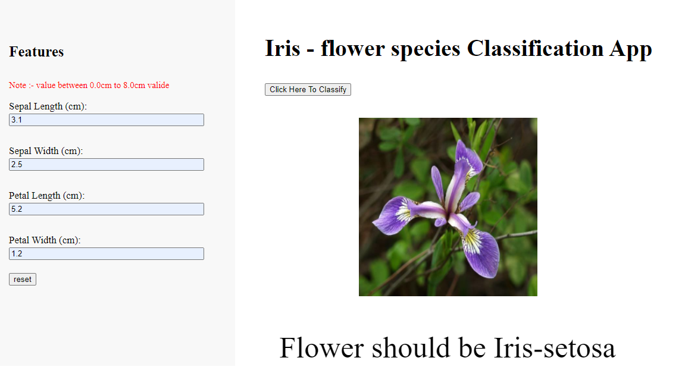

# Hello World of Machine Learning

This is a first dataset that every Machine Learning engineer or Data Scientist came across most of time that's why this is  ```HelloWorld.py``` of Data Science.

## Description
The Iris dataset was used in R.A. Fisher's classic 1936 paper, The [Use of Multiple Measurements in Taxonomic Problems](https://rcs.chemometrics.ru/Tutorials/classification/Fisher.pdf), and can also be found on the [UCI Machine Learning Repository.](http://archive.ics.uci.edu/ml/index.php)

It includes three iris species with 50 samples each as well as some properties about each flower. One flower species is linearly separable from the other two, but the other two are not linearly separable from each other.

The columns in this dataset are:

* sepal_length
* sepal_width
* petal_length
* petal_width
* species

Predicted Attribute: Different Species of Iris plant.




 


## Installation

`pip install -r requirements.txt`

`python model.py`

`python app.py`



## Built With
* [Flask](https://flask.palletsprojects.com/en/2.0.x/) - The web framework used
* [PIP](https://pypi.org/project/pip/) - Dependency Management

## Purpose
The purpose of this project was to gain introductory exposure to Machine Learning Classification concepts along with data visualization. The project makes heavy use of Scikit-Learn, Pandas and Data Visualization Libraries.

## Contributing
Pull requests are welcome. For major changes, please open an issue first to discuss what you would like to change.

Please make sure to update tests as appropriate.

## License

[MIT](https://github.com/Rahul-404/Iris_Species_Classification_End_to_End/blob/master/LICENSE)